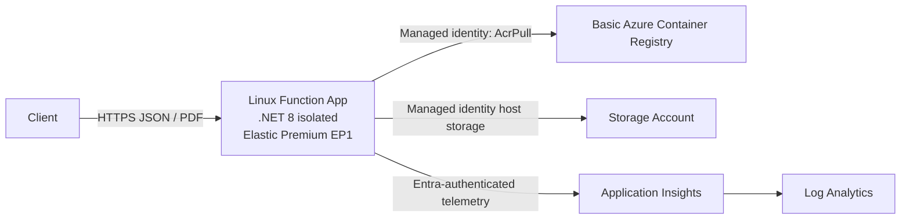

# PuppeteerSharp PDF on Azure Functions

This public-ready .NET 8 sample is an Azure Functions v4 isolated-worker app in a Linux custom container. It accepts structured invoice JSON, builds an accessible HTML document, renders it with PuppeteerSharp and system Chromium, and returns an A4 PDF with backgrounds.

The API deliberately does **not** accept arbitrary URLs or raw HTML. Chromium only receives generated, HTML-encoded content from the validated invoice model.

## Endpoints

| Method | Route | Behavior |
|---|---|---|
| `POST` | `/api/render-invoice` | Validates invoice JSON and returns an `application/pdf` attachment. |
| `GET` | `/api/container-info` | Reports .NET, OS/architecture, and the configured Chromium path/version. |

Both endpoints use anonymous authorization for demo use. Invalid invoices return HTTP 400 with field-level details, malformed JSON returns HTTP 400, and bodies over 256 KiB return HTTP 413.

## Project layout

| Path | Purpose |
|---|---|
| `Functions/` | .NET isolated HTTP triggers. |
| `Models/` | Validated invoice records and validation errors. |
| `Services/` | Validation, safe filename creation, accessible HTML, Chromium discovery, and PuppeteerSharp PDF rendering. |
| `tests/` | xUnit tests for validation, escaping, HTML semantics, totals, A4 CSS, and filenames. |
| `samples/invoice.json` | Request payload used by local, container, and deployed tests. |
| `Dockerfile` | Multi-stage .NET 8 build on the official Functions .NET isolated Linux image with system Chromium. |
| `infra/main.bicep` | Elastic Premium, ACR, Storage, monitoring, managed identity, and RBAC. |
| `scripts/smoke-test.ps1` | Repeatable local Docker build and endpoint smoke test. |
| `scripts/deploy.ps1` | Optional future Azure deployment and endpoint verification. |

## Prerequisites

For local .NET execution:

- .NET 8 SDK
- Azure Functions Core Tools v4
- Chrome, Edge, or Chromium
- PowerShell 7 or Windows PowerShell 5.1

For container execution:

- Docker Desktop or another Linux-container Docker engine

For optional Azure validation or deployment:

- Azure CLI with Bicep
- An Azure subscription and existing resource group
- Permission to create resources and role assignments

The repository was scaffolded with Azure Functions Core Tools 4.6 using the current .NET 8 isolated-worker template. PuppeteerSharp is pinned in the project file and does not download a browser; the Docker image uses `/usr/bin/chromium`.

## Build and test

From the repository root:

```powershell
dotnet restore .\AzureFunctions.PuppeteerSharpPdf.sln
dotnet build .\AzureFunctions.PuppeteerSharpPdf.sln --configuration Release
dotnet test .\AzureFunctions.PuppeteerSharpPdf.sln --configuration Release --no-build
```

The tests do not launch a browser. They exercise the security boundary around structured input and the generated HTML.

## Run with Functions Core Tools

Copy the example settings without committing the resulting local file:

```powershell
Copy-Item .\local.settings.example.json .\local.settings.json
```

Edit `CHROMIUM_PATH` if Chrome is installed elsewhere. Common Windows values are:

```text
C:\Program Files\Google\Chrome\Application\chrome.exe
C:\Program Files (x86)\Microsoft\Edge\Application\msedge.exe
```

If `UseDevelopmentStorage=true` is used and your local Functions host requires storage, start Azurite before starting the app. The two functions themselves use only HTTP triggers.

Start the Functions host:

```powershell
func start
```

In another PowerShell window, inspect the runtime:

```powershell
Invoke-RestMethod http://localhost:7071/api/container-info | ConvertTo-Json -Depth 5
```

Render the sample invoice:

```powershell
Invoke-WebRequest `
  -Uri http://localhost:7071/api/render-invoice `
  -Method Post `
  -ContentType application/json `
  -InFile .\samples\invoice.json `
  -OutFile .\invoice-local.pdf
```

Verify that `invoice-local.pdf` opens as a PDF. To check validation, send an unsupported field:

```powershell
$invalid = @{
  invoiceNumber = 'INV-1'
  customerName = 'Example'
  lineItems = @(@{
    description = 'Item'
    quantity = 1
    unitPrice = 10
    url = 'https://example.com'
  })
} | ConvertTo-Json -Depth 5

Invoke-RestMethod `
  -Uri http://localhost:7071/api/render-invoice `
  -Method Post `
  -ContentType application/json `
  -Body $invalid
```

The request returns HTTP 400 because `lineItems[0].url` is not supported.

## Build and test the Linux container

The repeatable smoke test builds the image, starts one uniquely named container, waits for the Functions host, verifies `/usr/bin/chromium`, renders the sample invoice, checks the `%PDF-` signature, and removes only that exact container:

```powershell
.\scripts\smoke-test.ps1
```

Use a different host port if 8080 is occupied:

```powershell
.\scripts\smoke-test.ps1 -Port 8081
```

If your network requires an approved NuGet mirror, pass it only at build time:

```powershell
.\scripts\smoke-test.ps1 -NuGetSource https://your-approved-mirror.example/v3/index.json
```

Test an image that is already built:

```powershell
.\scripts\smoke-test.ps1 `
  -ImageName puppeteersharp-invoice-functions:local `
  -SkipBuild
```

Manual container commands are:

```powershell
docker build --tag puppeteersharp-invoice-functions:local .
docker run --rm --name puppeteersharp-invoice-demo --publish 8080:80 puppeteersharp-invoice-functions:local
```

Then call:

```powershell
Invoke-RestMethod http://localhost:8080/api/container-info

Invoke-WebRequest `
  -Uri http://localhost:8080/api/render-invoice `
  -Method Post `
  -ContentType application/json `
  -InFile .\samples\invoice.json `
  -OutFile .\invoice-container.pdf
```

## Container design

The Dockerfile uses two official Microsoft images:

1. `mcr.microsoft.com/dotnet/sdk:8.0` builds the isolated-worker app.
2. `mcr.microsoft.com/azure-functions/dotnet-isolated:4-dotnet-isolated8.0` runs it on the current Functions v4 .NET 8 isolated Linux base.

Only the required browser packages are added: Debian Chromium, Liberation fonts, and Noto core fonts. `CHROMIUM_PATH=/usr/bin/chromium` ensures PuppeteerSharp controls that system browser rather than downloading a second one.

The PDF renderer launches Chromium with container-compatible flags, loads only the generated local HTML, prints with backgrounds, honors the CSS A4 page size, and closes the browser after each request. Browser launches consume CPU and memory, so load-test realistic invoices before increasing Functions concurrency or scale limits.

## Azure architecture



The Bicep template targets an existing resource group and creates:

- A Basic Azure Container Registry with admin credentials disabled
- A Storage account with shared keys disabled
- Log Analytics and workspace-based Application Insights
- A Linux Elastic Premium EP1 plan
- A custom-container Function App with `FUNCTIONS_WORKER_RUNTIME=dotnet-isolated`
- Managed-identity role assignments for ACR pull, Functions host storage, and telemetry

EP1 maintains a minimum allocated worker and incurs ongoing cost. Review region availability, quota, policy, networking, scale, and RBAC before deployment.

## Validate infrastructure without deploying

Compile the template locally:

```powershell
az bicep build --file .\infra\main.bicep
```

If you have an existing resource group, perform server-side validation without creating resources:

```powershell
az deployment group validate `
  --resource-group <existing-resource-group> `
  --template-file .\infra\main.bicep `
  --parameters `
    namePrefix=pdfdemo `
    imageRepository=puppeteersharp-invoice-functions `
    imageTag=v1
```

## Deploy later

This repository does not deploy anything automatically. When you intentionally want to create Azure resources, sign in to the intended subscription and run:

```powershell
az login
az account set --subscription <subscription-id-or-name>

.\scripts\deploy.ps1 `
  -ResourceGroupName <existing-resource-group> `
  -NamePrefix pdfdemo `
  -Location eastus2 `
  -ImageTag v1
```

The deployment script:

1. Deploys the Bicep resources into the existing resource group.
2. Enables ARM-audience authentication for ACR.
3. Builds and pushes the immutable image tag with `az acr build`.
4. Updates and restarts the Function App.
5. Waits for `container-info`.
6. Renders the sample invoice and verifies a PDF response.

It uses the Azure CLI's currently selected subscription and does not embed credentials.

After deployment, test the endpoints directly:

```powershell
$baseUrl = 'https://<function-app-name>.azurewebsites.net'

Invoke-RestMethod "$baseUrl/api/container-info" | ConvertTo-Json -Depth 5

Invoke-WebRequest `
  -Uri "$baseUrl/api/render-invoice" `
  -Method Post `
  -ContentType application/json `
  -InFile .\samples\invoice.json `
  -OutFile .\invoice-deployed.pdf
```

Use a new image tag for every release:

```powershell
.\scripts\deploy.ps1 `
  -ResourceGroupName <existing-resource-group> `
  -NamePrefix pdfdemo `
  -ImageTag v2
```

## Security notes

- Input is a closed invoice schema; unknown fields, URLs, and raw HTML are rejected.
- All user text is HTML-encoded before it reaches Chromium.
- Request bodies and field sizes are bounded.
- Response filenames are reduced to safe ASCII characters.
- PDFs are returned with `no-store` and `nosniff` headers.
- The container installs only Chromium and the fonts used by the invoice.
- ACR uses managed identity rather than admin credentials.
- The sample stores no invoice data and writes logs to stdout/stderr.
- Rebuild regularly to pick up .NET, Functions base-image, Chromium, and Debian security updates.
